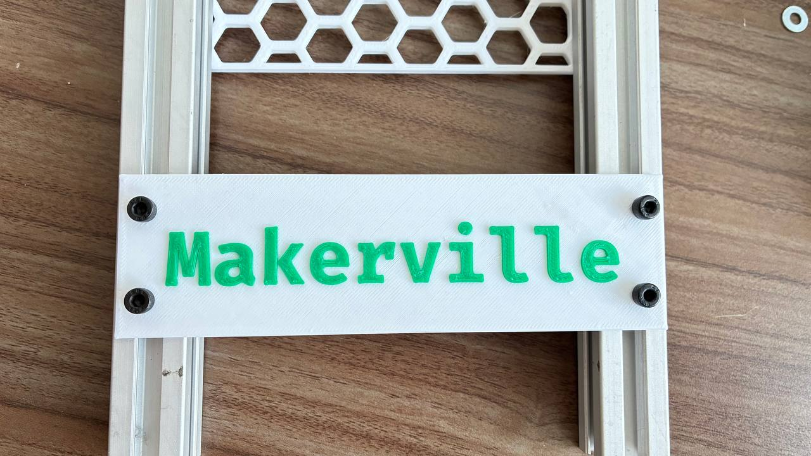
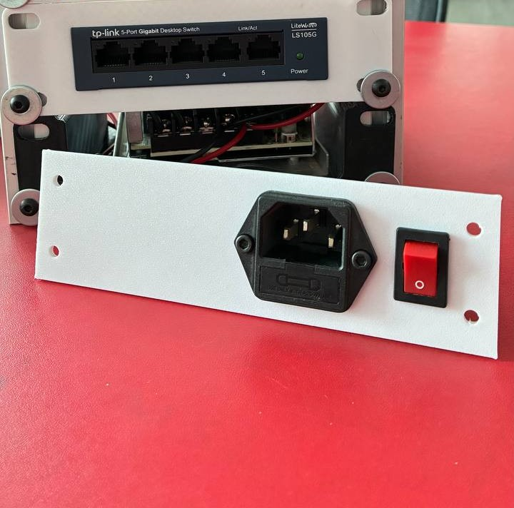

# Makerville Mini Racks

A library to generate 3D printable trays and plates for mini racks - with <3 from the [Makerville community](https://makerville.io/).

## Installation

- Install [BOSL2](https://github.com/BelfrySCAD/BOSL2/wiki#installation)
- Install [JL_SCAD](https://github.com/lijon/jl_scad?tab=readme-ov-file#installation)
- Clone this repository to your OpenSCAD libraries folder

## Contributing

- use [scadformatter](https://github.com/hugheaves/scadformat/) to format the files before opening a pull request
- add an example of your new module to `examples/All.scad`